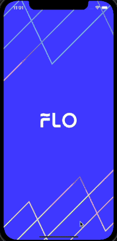

# Purpose

[Programmers](https://programmers.co.kr/skill_check_assignments/2) 에서 진행한 iOS - 뮤직플레이어를 수행한 샘플 프로젝트입니다. 
- [Programmers](https://programmers.co.kr/skill_check_assignments/2) 에서 진행하실 수 있습니다. 

최대한 FLO 앱처럼 비슷하게 만들려고 노력했습니다. 

구현하는 과정에서 많이 경험할 수 있었기 때문에 이렇게 유익한 과제를 내주신 FLO와 Programmers에게 감사드립니다. 

> ⬇️ Demo 

# Implemented function 
1. 현재 재생중인 가사 하이라이팅 
> 다양한 방법이 있겠지만, 저는 UITableView로 구현했습니다. 
2. Seekbar를 터치하여 음악구간 변경 
> ProgressView에 Touch를 달아 구현했습니다. 
3. 전체가사화면에서 특정 가사 터치시, 음악구간 변경
4. Seekbar 터치시 약간의 애니메이션 및 음악구간시간 보여주는 label 구현 
> FLO앱을 참고하여 추가적으로 구현했습니다.
5. 가사터치시 전체가사화면으로의 전환 및 약간의 애니메이션
> FLO앱을 참고하여 추가적으로 구현했습니다. 

# Used skill  
- AVAudioFoundation
- XCTest 
> 통신과정을 테스트하기 위해 작성했습니다. 
- UIViewControllerAnimatedTransitioning
> ViewController를 전환하는 과정에서 간단한 애니메이션 적용했습니다. 
- UITableView
- UIView 
- .xib 
> 재사용하기 위해 .xib으로 구현했습니다. 
